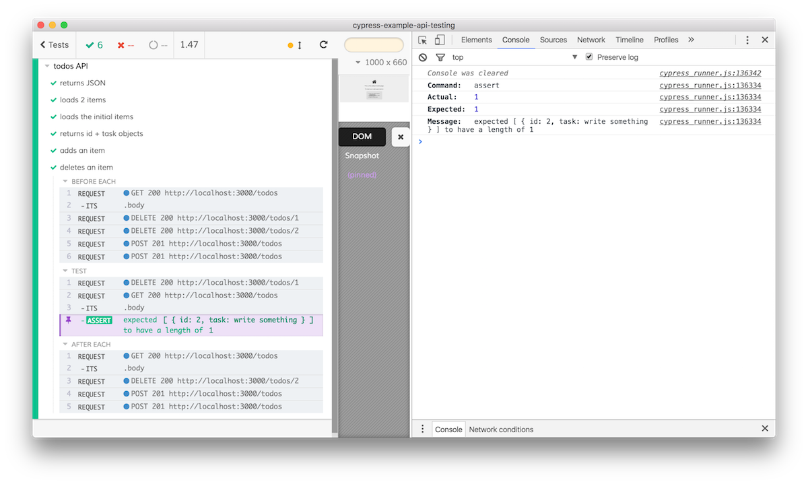

# cypress-example-api-testing.
# Original content is from this blog :  https://www.cypress.io/blog/2017/11/07/add-gui-to-your-e2e-api-tests/

> [Cypress](https://cypress.op) E2E runner can also test Rest and other APIs

 [![renovate-app badge][renovate-badge]][renovate-app]

[renovate-badge]: https://img.shields.io/badge/renovate-app-blue.svg
[renovate-app]: https://renovateapp.com/

See related blog post [Add GUI to your E2E API tests](https://www.cypress.io/blog/2017/11/07/add-gui-to-your-e2e-api-tests/)

## Use

Install dependencies with `npm install`

See scripts in `package.json` 

* `npm run cy:open` - runs Cypress in GUI mode
* `npm run cy:run` - runs Cypress in command mode
* `npm test` - starts the local API server and runs Cypress tests against it in headless mode
